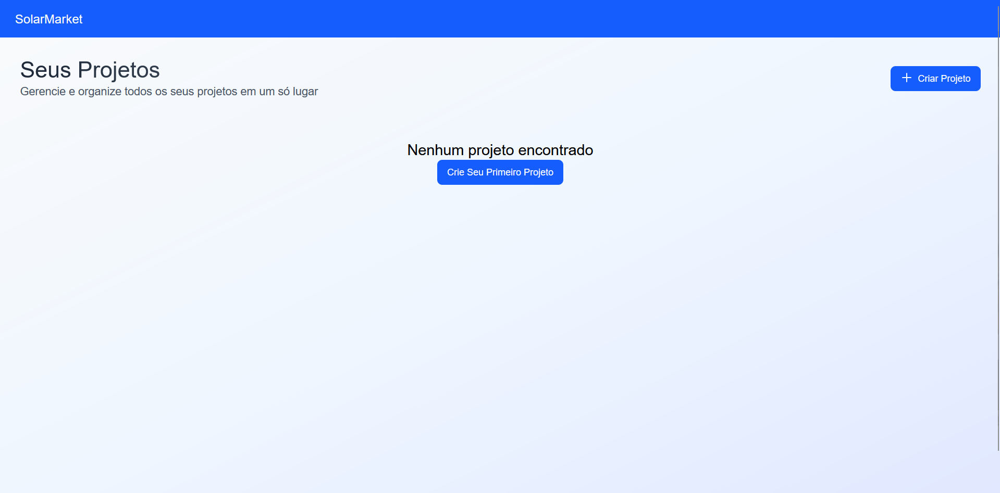
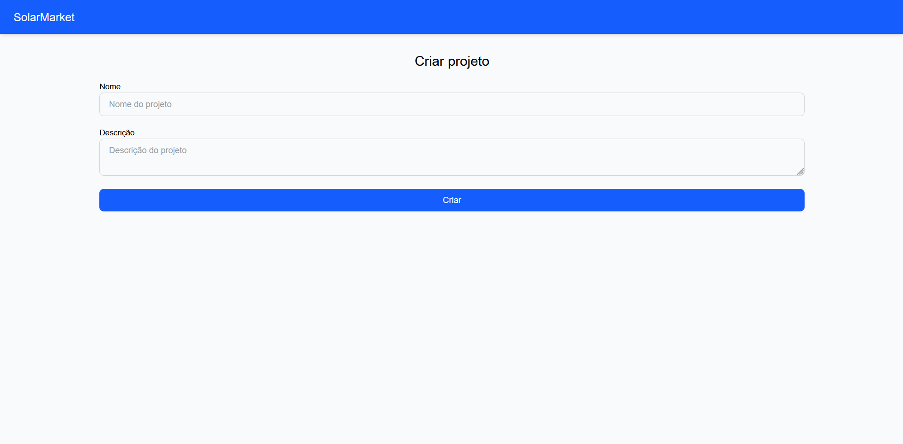
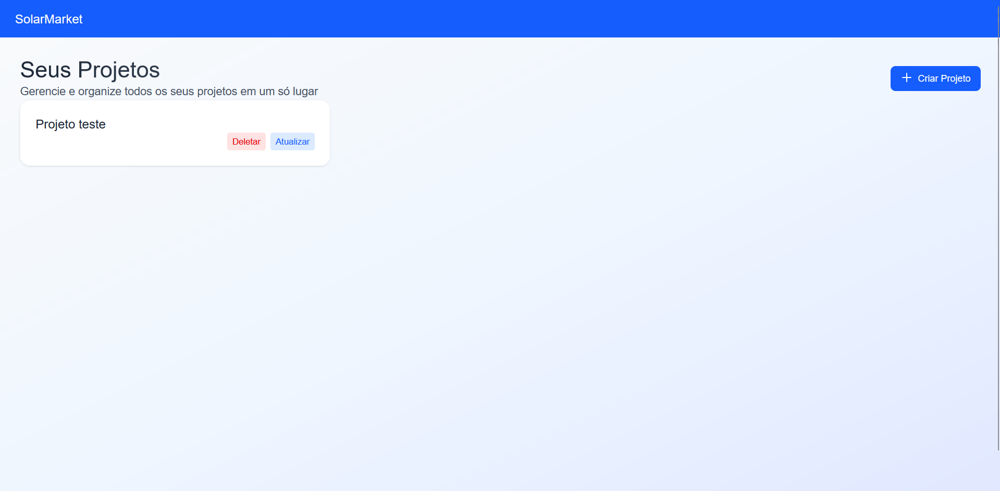
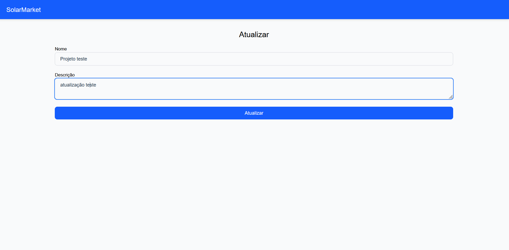
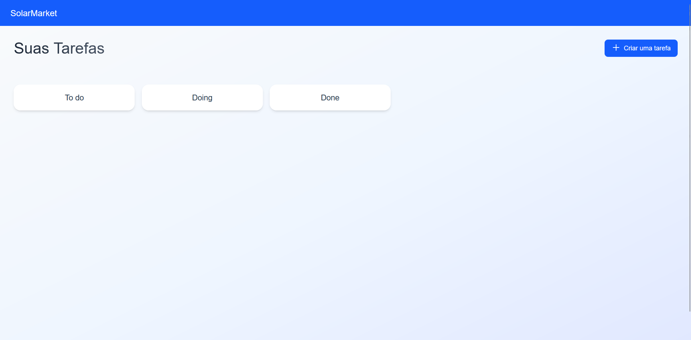
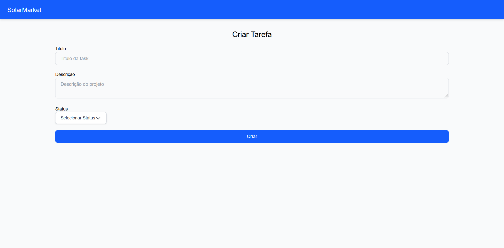
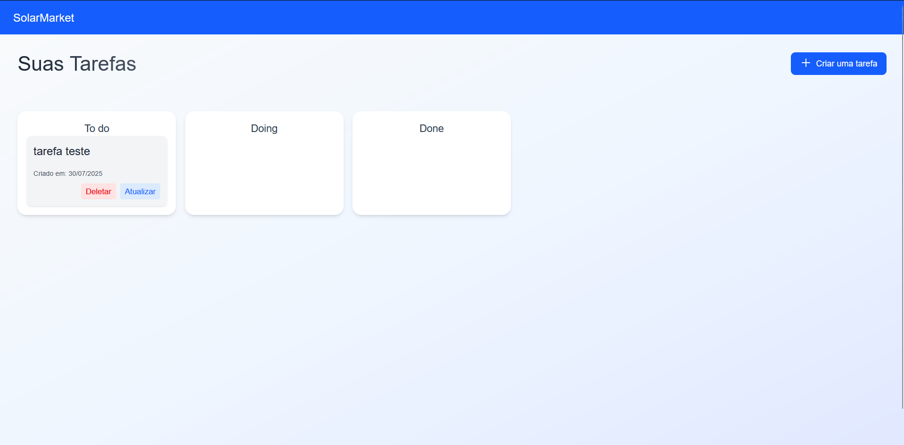
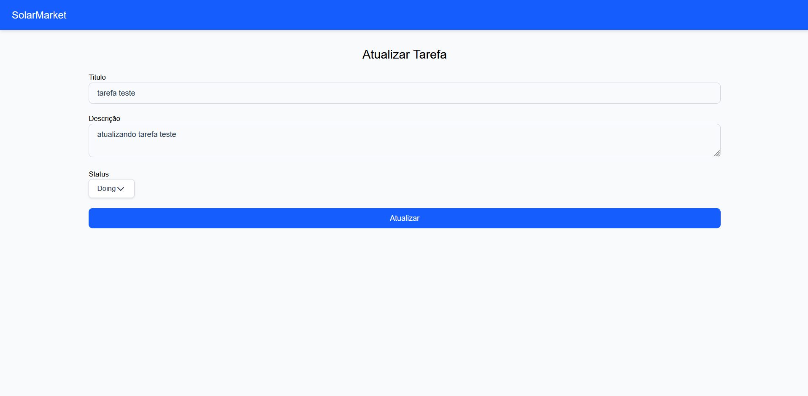
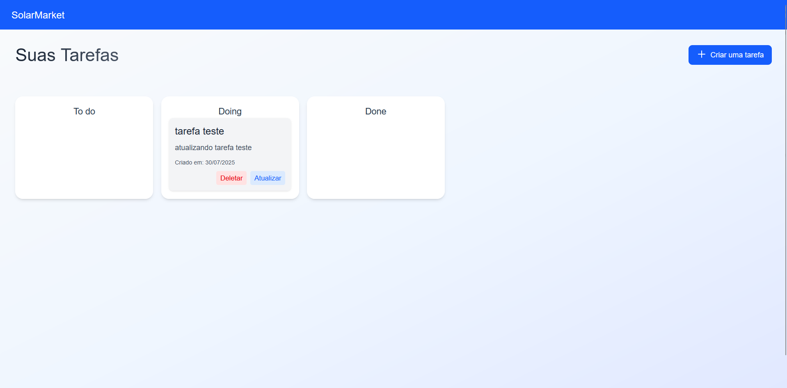

# Teste SolarMarket

Esta aplicação de gerenciamento de projetos foi desenvolvida como parte do teste técnico para a empresa SolarMarket.

## Índice

- [Sobre o Projeto](#sobre-o-projeto)
- [Telas do Projeto](#telas-do-projeto)
- [Tecnologias Utilizadas](#tecnologias-utilizadas)
- [Pré-requisitos](#pré-requisitos)
- [Configurações](#configurações)
- [Instalação](#instalação)
- [O que faria diferente com mais tempo](#o-que-faria-diferente-com-mais-tempo)
- [O que gostaria de melhorar](#o-que-gostaria-de-melhorar)

## Sobre o Projeto

Este projeto é uma aplicação web de gerenciamento de projetos, desenvolvida com o objetivo de atender ao teste técnico da empresa SolarMarket. Ele simula um ambiente de produtividade onde usuários podem organizar tarefas, acompanhar o andamento de projetos e gerenciar diferentes colunas de status (como “A fazer”, “Em andamento” e “Concluído”).

Este já era um projeto que eu tinha vontade de desenvolver, como forma de praticar e testar algumas habilidades e tecnologias. Por isso, decidi aproveitar a oportunidade para colocá-lo em prática.

### Telas do Projeto

#### Tela principal


#### Tela de criação do projeto


#### Tela principal com um projeto criado


#### Tela de atualização do projeto


#### Tela das tarefas


#### Tela de criação das tarefas


#### Tela das tarefas com uma tarefa criada


#### Tela de atualização das tarefas


#### Tela das tarefas com a tarefa atualizada


## Tecnologias Utilizadas

### Frontend

* **Vue.js** – Framework JavaScript para interfaces reativas
* **TypeScript** - Superset do JavaScript com tipagem estática
* **Tailwind CSS** – Framework utilitário para estilização rápida
* **Axios** – Cliente HTTP para requisições assíncronas
* **Prettier** – Formatador automático de código
* **Dotenv** – Gerenciador de variáveis de ambiente

### Backend

* **NestJS** – Framework Node.js para aplicações escaláveis
* **TypeScript** – Tipagem segura e robusta no backend
* **Express** – Servidor web leve para Node.js
* **Sequelize** – ORM para bancos relacionais
* **MySQL** – Banco de dados relacional
* **Dotenv** – Gerenciador de variáveis de ambiente
* **UUID** – Geração de identificadores únicos
* **Prettier** – Padronização de código

### Ferramentas

* **Docker** – Contêineres para ambientes isolados
* **ESLint** – Linter para identificar problemas no código

## Pré-requisitos

Antes de começar, verifique se você tem os seguintes requisitos instalados:

- Node.js (versão 16.0 ou superior)
- npm ou yarn
- Docker (opcional)
- Git

```bash
# Verificar versões
node --version
npm --version
git --version
```

## Configurações

Antes de iniciar o projeto, é necessário configurar as variáveis de ambiente. Siga os passos abaixo:

### 1. Clone o repositório

```bash
git clone https://github.com/LianMiranda/JR-lian-souza-miranda-mendes.git
cd JR-lian-souza-miranda-mendes
```

### 2. Configure as variáveis de ambiente

#### 1. Backend
 Crie um arquivo `.env` na pasta "server" e copie o conteúdo do `.env.example`:

```bash
##Db config
DB_NAME=db_name
DB_USER=db_user
DB_PASSWORD=db_password
DB_HOST=db_host
DB_PORT=db_port

##App config
PORT=app_port
```

Preencha as variáveis conforme necessário. Exemplo de variáveis esperadas caso rode com o docker:

```env
##Db config
DB_NAME=teste
DB_USER=usertest
DB_PASSWORD=passtest
DB_HOST=mysql  
DB_PORT=3306

##App config
PORT=3000
```
> **Notas:**  Se estiver executando com Docker, pode utilizar as variáveis do Db config acima. Caso contrário, defina os valores conforme as configurações do seu ambiente local.

#### 2. Frontend
Crie um arquivo `.env` na pasta "client" e copie o conteúdo do `.env.example`:

```bash
VITE_API_URL=api_url
```

Preencha a variável com a url da API. Exemplo de variáveis esperadas:

```env
VITE_API_URL=http://localhost:3000
```

## Instalação

### Instalação com Docker

1. Clone o repositório
```bash
git clone https://github.com/LianMiranda/JR-lian-souza-miranda-mendes.git
cd JR-lian-souza-miranda-mendes
```
2. Preencha os dados do arquivo .env, da pasta "server", com os dados do banco de dados MySQL definido no docker-compose
   
```env
##Db config
DB_NAME=teste
DB_USER=usertest
DB_PASSWORD=passtest
DB_HOST=mysql  
DB_PORT=3306
```

3. Execute com Docker Compose
```bash
docker-compose up -d
```

3. Abra no navegador 
[Acesse o projeto online](http://localhost/)

> A url provavelmente será: http://localhost/

> **Nota:** Certifique-se de que o Docker esteja instalado e em execução antes de iniciar os containers.

### Instalação Local

1. Para a documentação do backend acesse:
[Server](https://github.com/LianMiranda/JR-lian-souza-miranda-mendes/tree/main/server)

2. Para a documentação do frontend acesse:
[Client](https://github.com/LianMiranda/JR-lian-souza-miranda-mendes/tree/main/client)

## O que faria diferente com mais tempo
  * Daria um foco melhor nas questões de segurança da aplicação, como o retorno da API por exemplo.
  * Criaria um layout melhor.
  * Estudaria e aplicaria mais sobre a arquitetura do frontend.
  * Pensei em adicionar um sistema drag and drop na parte das tarefas, mas não tive muita segurança para implementar com o tempo que eu tinha.
  * Faria uma API GraphQL em vez de REST, como não conheo muito sobre a GraphQL não tive segurança em fazer.
  * Adicionaria login e registro de usuários


## O que gostaria de melhorar
  * Me senti meio enferrujado com o VueJs no geral, fazer esse projeto foi muito bom para "destravá-lo" de certa forma, além de reacender o meu interesse. Com certeza vou estudar mais sobre ele.
  * Tive dificuldade com a implementação do Sequelize no TypeScript, outro ponto que vou estudar mais.


**[⬆ Voltar ao topo](#teste-solarMarket)**
